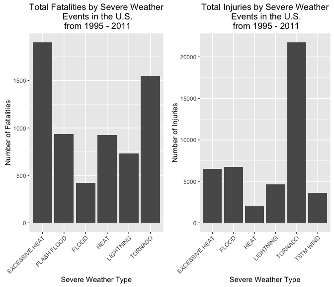

# Reproducible Research: Review of Storm Impacts


##Synopsis 
For this analysis, we utilized storm data from the U.S. National Oceanic and Atmospheric Administration's (NOAA) between the years of 1950 - 2011. The goal of this assessment was to identify events which had the greatest population health and economic consequences. In an effort to determine population health effects, we wpecifically looked at the resulting fatalities and injuries left after various types of storms. Regarding economic health, we reviewed the property and crop damage estimates from the various types of events. 

## Data Processing

I first loaded the data via a common read.csv format and reviewed what the first six rows looked like using the head() command. 


```r
stormdata <- read.csv("/Users/Sandeep/GitHub/Reproducible_Research/StormData.csv")
dim(stormdata)
```

```
## [1] 902297     37
```

```r
head(stormdata)
```

```
##   STATE__           BGN_DATE BGN_TIME TIME_ZONE COUNTY COUNTYNAME STATE
## 1       1  4/18/1950 0:00:00     0130       CST     97     MOBILE    AL
## 2       1  4/18/1950 0:00:00     0145       CST      3    BALDWIN    AL
## 3       1  2/20/1951 0:00:00     1600       CST     57    FAYETTE    AL
## 4       1   6/8/1951 0:00:00     0900       CST     89    MADISON    AL
## 5       1 11/15/1951 0:00:00     1500       CST     43    CULLMAN    AL
## 6       1 11/15/1951 0:00:00     2000       CST     77 LAUDERDALE    AL
##    EVTYPE BGN_RANGE BGN_AZI BGN_LOCATI END_DATE END_TIME COUNTY_END
## 1 TORNADO         0                                               0
## 2 TORNADO         0                                               0
## 3 TORNADO         0                                               0
## 4 TORNADO         0                                               0
## 5 TORNADO         0                                               0
## 6 TORNADO         0                                               0
##   COUNTYENDN END_RANGE END_AZI END_LOCATI LENGTH WIDTH F MAG FATALITIES
## 1         NA         0                      14.0   100 3   0          0
## 2         NA         0                       2.0   150 2   0          0
## 3         NA         0                       0.1   123 2   0          0
## 4         NA         0                       0.0   100 2   0          0
## 5         NA         0                       0.0   150 2   0          0
## 6         NA         0                       1.5   177 2   0          0
##   INJURIES PROPDMG PROPDMGEXP CROPDMG CROPDMGEXP WFO STATEOFFIC ZONENAMES
## 1       15    25.0          K       0                                    
## 2        0     2.5          K       0                                    
## 3        2    25.0          K       0                                    
## 4        2     2.5          K       0                                    
## 5        2     2.5          K       0                                    
## 6        6     2.5          K       0                                    
##   LATITUDE LONGITUDE LATITUDE_E LONGITUDE_ REMARKS REFNUM
## 1     3040      8812       3051       8806              1
## 2     3042      8755          0          0              2
## 3     3340      8742          0          0              3
## 4     3458      8626          0          0              4
## 5     3412      8642          0          0              5
## 6     3450      8748          0          0              6
```

It looks like from the first several rows of data, that only Tornados were taken into account for the first years of data.


```r
if (dim(stormdata)[2] == 37) {
    stormdata$year <- as.numeric(format(as.Date(stormdata$BGN_DATE, format = "%m/%d/%Y %H:%M:%S"), "%Y"))
}
```


```r
hist(stormdata$year, col= "red", breaks = 10, xlab="Year", main= "Storm Events per Year")
```

\

Looking at the histogram, it's unlikely that all of a sudden in 1995 there became significantly more storms than in the past. More likely, it's that more storms began to be reported starting in 1995. For that reason, we will look at data from 1995 and after. 


```r
stormdata95 <- stormdata[stormdata$year >= 1995, ]
```

###Population Health 

The first question revolved around the looking to understand the most harmful types of events to population health. Based on the first six rows of data, I was able to see that the effects of population health can be viewed by both the fatalities and injuries of an event. To look deeper, I first grouped the data by event type, and then looked at the summarized number of fatalities and injuries for each event. 


```r
library(dplyr)
```

```
## 
## Attaching package: 'dplyr'
```

```
## The following objects are masked from 'package:stats':
## 
##     filter, lag
```

```
## The following objects are masked from 'package:base':
## 
##     intersect, setdiff, setequal, union
```

```r
library(ggplot2)
```

```
## Warning: package 'ggplot2' was built under R version 3.2.3
```

```r
library(knitr)
```

```
## Warning: package 'knitr' was built under R version 3.2.3
```

```r
events <- group_by(stormdata95, EVTYPE)
eventimpact <- summarize(events, sum(FATALITIES, na.rm=TRUE), sum(INJURIES, na.rm=TRUE))
colnames(eventimpact) <- c("event","fatalities","injuries")
```

Next, I ordered the data in two sets to view which events had the most fatalities, and which events had the most injuries. Utilizing the head() command once again, I was able to pull out the first six rows of each, which we will be able to review in the results section. 


```r
fatalities <- eventimpact[with(eventimpact, order(-fatalities)), ]
injuries <- eventimpact[with(eventimpact, order(-injuries)), ]

fatalities <- head(fatalities)
injuries <- head(injuries)
```

Lastly, I put together a bar charts to be able to show the events which led to the most fatalities and injuries. 


```r
library(grid)
library(gridExtra)
fatalitiesplot <- qplot(event, data = fatalities, weight = fatalities, geom = "bar") + 
    scale_y_continuous("Number of Fatalities") + 
    theme(axis.text.x = element_text(angle = 45, 
    hjust = 1)) + xlab("Severe Weather Type") + 
    ggtitle("Total Fatalities by Severe Weather\n Events in the U.S.\n from 1995 - 2011")
    
injuriesplot <- qplot(event, data = injuries, weight = injuries, geom = "bar") + 
    scale_y_continuous("Number of Injuries") + 
    theme(axis.text.x = element_text(angle = 45, 
    hjust = 1)) + xlab("Severe Weather Type") + 
    ggtitle("Total Injuries by Severe Weather\n Events in the U.S.\n from 1995 - 2011")
```

###Economic Consequences 

I utilized a similar approach in attempting to understand the events that 
have the greatest economic consequences. Utilizing the grouping of events created earlier, I was able to summarize the data based on the sum of property damages and crop damages. 


```r
costimpact <- summarize(events, sum(PROPDMG, na.rm=TRUE), sum(CROPDMG, na.rm=TRUE))
colnames(costimpact) <- c("event","propertydmg","cropdmg")
```

Based on the head () command, I once again ordered the data and pulled the top six events with the most property damage costs, crop damage costs, and total damage costs. 


```r
costimpact$totalcost <-  with(costimpact, propertydmg + cropdmg)
costimpact <- costimpact[with(costimpact, order(-totalcost)), ]
propdmgcost <- costimpact[with(costimpact, order(-propertydmg)), ]
cropdmgcost <- costimpact[with(costimpact, order(-cropdmg)), ]
totaldmgcost <- head(costimpact)
propdmgcost <-head(propdmgcost)
cropdmgcost <-head(cropdmgcost)
```

Finally, I plotted three graphs for the data. 


```r
totalcostplot <- qplot(event, data = totaldmgcost, weight = totalcost, geom = "bar") + 
    scale_y_continuous("Total Cost") + 
    theme(axis.text.x = element_text(angle = 45, 
    hjust = 1)) + xlab("Severe Weather Type") + 
    ggtitle("Total Cost by Severe Weather\n Events in the U.S.\n from 1995 - 2011")
```

##Results 

Below, I have included the results of the analysis. 

###Population Health 


```r
grid.arrange(fatalitiesplot,injuriesplot, ncol=2)
```

\
Based on the analysis, it looks like the highest number of fatalities have come from excessive heat. However, the most injuries by far came from tornadoes. These two contribute the most to the US's population health.

###Economic Consequences 


```r
totalcostplot
```

\

Adding the property damage and crop costs together, we can see that flash floods, tornados, and tstm wind have the largest negative economic effects on the US. However, other events have very costly effects as well. 

## Conclusion 

This data has taught us a lot about the key events which lead to health and economic issues in the US. We should be cognizant of these issues and try to do our best to prepare for these events in the future. Additional analysis may look into where these events occur in the US. 
